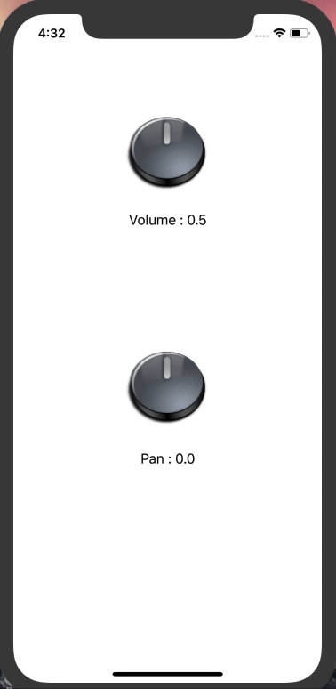

# RotatingButton
Rotating Button in swift.

 

Sample Code

        knobVolume.addTarget(self, action:#selector(volumeValueChanged(_:)), for: UIControl.Event.valueChanged)
   
        @objc func volumeValueChanged(_ sender: Any) {
        
            lblTextVolume.text = "Volume : \((Double(knobVolume.volume)).rounded(toPlaces: 2))"
        
        }
